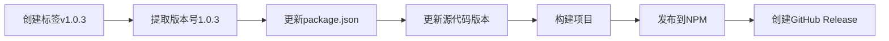

# 🚀 智能版本发布系统

## 📋 概述

新的发布系统解决了版本号冲突的问题，现在：
- **package.json的版本号可以保持固定**（如1.0.0）
- **发布时从Git标签自动提取版本号**
- **避免版本覆盖和冲突问题**

## 🔧 工作原理

### 1. 智能版本提取
当你创建标签 `v1.0.3` 时，GitHub Actions会：
- 自动提取版本号 `1.0.3`（去掉v前缀）
- 更新 `package.json` 中的版本号
- 更新源代码中的版本号显示

### 2. 自动化流程


## 📝 使用方法

### 方法1: 使用智能发布脚本（推荐）

```bash
# 发布新版本
./smart-release.sh 1.0.3

# 脚本会自动：
# 1. 检查Git状态
# 2. 验证版本号可用性
# 3. 创建并推送标签
# 4. 触发自动发布
```

### 方法2: 手动创建标签

```bash
# 创建标签
git tag v1.0.3

# 推送标签（触发发布）
git push origin v1.0.3
```

## 🔍 改进的工作流程特性

### 新增步骤：

1. **版本提取** - 从Git标签智能提取版本号
2. **动态版本更新** - 自动更新package.json和源代码
3. **版本验证** - 确保标签和包版本一致
4. **增强的Release信息** - 包含详细的版本和安装信息
5. **可选的版本提交** - 将版本更新提交回仓库

### 错误处理：

- ✅ 标签格式验证（必须是vX.Y.Z格式）
- ✅ NPM Token验证
- ✅ 版本号匹配检查
- ✅ 详细的错误日志

## 📊 版本号规则

### 标签格式
- ✅ `v1.0.3` - 正确
- ✅ `v2.1.0` - 正确
- ❌ `1.0.3` - 错误（缺少v前缀）
- ❌ `v1.0` - 错误（不完整的版本号）

### 语义化版本
- **MAJOR.MINOR.PATCH** (1.0.3)
- **Major**: 不兼容的API更改
- **Minor**: 向后兼容的功能添加
- **Patch**: 向后兼容的错误修复

## 🎯 发布流程示例

### 完整发布流程：

```bash
# 1. 确保代码已提交
git add -A
git commit -m "feat: 添加新功能"
git push origin main

# 2. 使用智能发布脚本
./smart-release.sh 1.0.3

# 3. 监控发布进度
# 访问: https://github.com/iptton-ai/wxcloud-mcp/actions

# 4. 验证发布结果
npm view wxcloud-mcp@1.0.3
```

## 📈 发布后自动生成的内容

### NPM包更新
- 版本号: 自动从标签提取
- 包内容: 最新构建的代码
- 发布时间: 自动记录

### GitHub Release
- 标题: Release v1.0.3
- 描述: 包含安装命令、版本信息、功能列表
- 资产: 自动附加源代码

### 仓库更新（可选）
- package.json版本号更新
- 源代码版本号同步
- 自动提交到main分支

## 🔧 配置说明

### package.json基础版本
```json
{
  "version": "1.0.0"
}
```

**这个版本号可以保持不变！**发布时会自动从标签更新。

### GitHub Secrets要求
- `NPM_TOKEN`: NPM发布令牌
- `GITHUB_TOKEN`: 自动提供（用于创建Release）

## 🚨 注意事项

### 发布前检查
1. ✅ 代码已提交并推送
2. ✅ 所有测试通过
3. ✅ 版本号遵循语义化规则
4. ✅ NPM_TOKEN已配置

### 版本号管理
- 🔒 **不要**手动修改package.json中的版本号
- 🔒 **不要**创建重复的标签
- 🔒 **不要**删除已发布的标签

### 回滚策略
如果发布出现问题：
1. 不要删除NPM上的版本（NPM不允许）
2. 修复问题后发布新的patch版本
3. 在GitHub Release中标记问题版本

## 📞 获取帮助

### 发布失败时检查：
1. **GitHub Actions日志**: 详细的错误信息
2. **NPM Token**: 是否正确配置且有效
3. **版本号**: 是否已存在或格式错误
4. **网络连接**: NPM服务是否可用

### 有用的命令：
```bash
# 检查当前版本
npm view wxcloud-mcp version

# 查看所有版本
npm view wxcloud-mcp versions --json

# 检查本地标签
git tag -l | grep "^v" | sort -V

# 删除本地标签（如果需要）
git tag -d v1.0.3
```

---

**现在你可以更轻松地管理版本发布，避免版本号冲突！** 🎉
