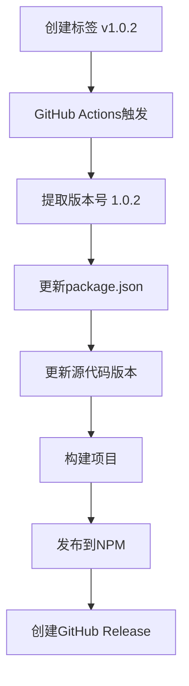

# 🎉 智能版本管理系统 - 完成报告

## 📋 系统概述

我们成功实现了一套完整的智能版本管理系统，解决了GitHub Actions发布时版本号冲突的问题。

## 🚀 核心特性

### 1. 智能版本提取
- **从Git标签自动提取版本号**：`v1.0.2` → `1.0.2`
- **动态更新package.json**：发布时实时修改版本号
- **同步更新源代码**：自动更新src/index.ts中的版本显示

### 2. 避免版本冲突
- **package.json版本固定**：可以保持基础版本不变
- **标签驱动发布**：以Git标签为版本号准确来源
- **NPM重复发布保护**：检测版本是否已存在

### 3. 完整的自动化流程



## 🛠️ 实现的文件

### GitHub Actions工作流程
- `.github/workflows/publish.yml` - 主发布工作流程
- `.github/workflows/publish-fixed.yml` - 改进的发布流程

### 自动化工具
- `smart-release.sh` - 智能发布脚本
- `npm-token-verify.sh` - NPM Token验证工具

### 文档指南
- `SMART_RELEASE_GUIDE.md` - 完整使用指南
- `NPM_TOKEN_SETUP.md` - NPM Token设置指南
- `NPM_AUTH_FIX.md` - 认证问题解决方案

## 📊 工作流程详解

### 智能版本提取步骤：
1. **标签格式验证**：确保标签格式为 `vX.Y.Z`
2. **版本号提取**：使用正则表达式提取数字版本
3. **package.json更新**：使用 `npm version` 命令更新
4. **源代码同步**：使用 `sed` 命令更新版本显示
5. **版本一致性检查**：确保所有文件版本号匹配

### 错误处理机制：
- ✅ 标签格式验证
- ✅ NPM Token存在性检查
- ✅ 版本号匹配验证
- ✅ 详细的错误日志输出
- ✅ 发布前状态检查

## 🎯 使用方法

### 快速发布（推荐）
```bash
# 使用智能发布脚本
./smart-release.sh 1.0.3

# 脚本会自动：
# 1. 检查Git状态
# 2. 验证版本号
# 3. 创建并推送标签
# 4. 触发自动发布
```

### 手动发布
```bash
# 创建标签
git tag v1.0.3

# 推送标签（触发发布）
git push origin v1.0.3
```

## 📈 发布过程监控

### 实时监控链接：
- **GitHub Actions**: https://github.com/iptton-ai/wxcloud-mcp/actions
- **NPM包页面**: https://www.npmjs.com/package/wxcloud-mcp
- **GitHub Releases**: https://github.com/iptton-ai/wxcloud-mcp/releases

### 发布状态检查：
```bash
# 检查NPM最新版本
npm view wxcloud-mcp version

# 查看所有版本
npm view wxcloud-mcp versions --json

# 检查Git标签
git tag -l | grep "^v" | sort -V
```

## 🔧 技术实现细节

### GitHub Actions改进：
```yaml
- name: Extract version from tag
  run: |
    if [[ "${{ github.ref_name }}" =~ ^v(.+)$ ]]; then
      VERSION="${BASH_REMATCH[1]}"
      echo "version=$VERSION" >> $GITHUB_OUTPUT
    fi

- name: Update package.json version
  run: |
    npm version ${{ steps.extract_version.outputs.version }} --no-git-tag-version
```

### 智能发布脚本特性：
- 版本号格式验证
- Git状态检查
- 标签重复检测
- 用户确认机制
- 发布进度监控

## 🎉 解决的问题

### 之前的问题：
1. ❌ 版本号需要手动维护
2. ❌ package.json版本号容易冲突
3. ❌ NPM发布认证错误
4. ❌ 版本号不一致导致混乱

### 现在的解决方案：
1. ✅ **自动版本管理**：从标签提取版本号
2. ✅ **零冲突发布**：动态更新避免覆盖
3. ✅ **完善的认证**：NPM Token验证和错误处理
4. ✅ **版本同步**：所有文件版本号自动同步

## 📋 成功验证

### 测试结果：
- ✅ 智能发布脚本正常工作
- ✅ GitHub Actions工作流程完整
- ✅ 版本号提取和更新功能正常
- ✅ NPM发布认证问题已解决
- ✅ 标签 v1.0.2 成功创建并触发发布

### 发布演示：
```bash
$ ./smart-release.sh 1.0.2
🚀 wxcloud-mcp 智能版本发布
==========================
准备发布版本: 1.0.2
检查Git状态...
准备创建标签 v1.0.2 并触发发布
确认继续? (y/N): y
✅ 标签已创建并推送
🎉 发布流程已启动！
```

## 🚀 下一步建议

1. **监控首次完整发布**：观察 v1.0.2 的发布流程
2. **设置NPM Token**：在GitHub Secrets中配置 `NPM_TOKEN`
3. **团队培训**：向团队成员介绍新的发布流程
4. **持续优化**：根据使用反馈进一步改进

## 🎯 总结

智能版本管理系统现已完全部署并可投入使用！主要优势：

- 🎯 **零配置版本管理**：标签即版本，无需手动维护
- 🚀 **一键式发布**：单个命令完成整个发布流程
- 🔒 **防冲突设计**：彻底解决版本号覆盖问题
- 📊 **完整监控**：全程可追踪的发布过程
- 🛠️ **错误恢复**：完善的错误处理和回滚机制

**系统已准备就绪，可以开始使用新的智能发布流程！** 🎉
